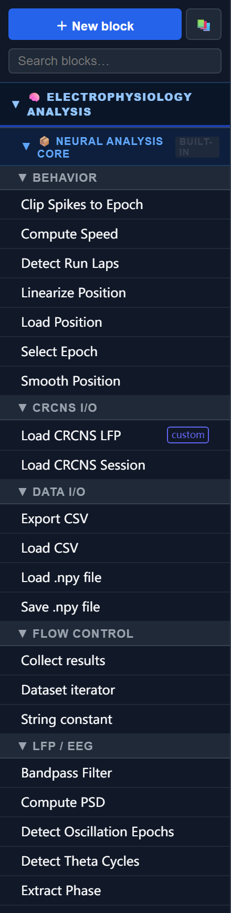

# Getting Started

SynapChart is a visual pipeline builder for neuroscience data analysis. You wire together blocks — each wrapping a single analysis step — into a workflow, then run the whole pipeline with one click.

---

## Installation

### Requirements

- Windows 10 or 11
- Python 3.10 or later ([download](https://www.python.org/downloads/))
- A conda environment is recommended (Anaconda or Miniconda)

### Install

```bash
# Recommended: create a clean environment
conda create -n synapchart python=3.11
conda activate synapchart

pip install synapchart
```

### Launch

```bash
synapchart
```

SynapChart starts a local server and opens your browser automatically at `http://localhost:8000`. Keep the terminal open while working — press `Ctrl+C` to stop the server when done.

---

## The Interface


SynapChart has four main areas:

### ① Side Panel (left)

The block library. All available blocks are listed here, grouped by library and category. Use the search box at the top to filter by name or description. Drag any block from this panel onto the canvas to add it to your workflow.

The **+ New Block** button opens the block creation wizard for writing a custom Python block.

### ② Canvas (center)

The main workspace. Each block appears as a node with input ports on its left edge and output ports on its right edge. Connect two blocks by clicking and dragging from an output port to an input port. Scroll to zoom, drag the background to pan.

Double-click any block to open its parameter editor.

### ③ Toolbar (top)

| Control | Action |
|---|---|
| **New / Open / Save** | File operations |
| **Templates** | Load a pre-built example workflow |
| **Run** | Execute the full pipeline |
| **Stop** | Cancel a running pipeline |

### ④ Run Progress Panel (bottom)

Appears while a pipeline is executing. Shows each block's status in execution order, a real-time progress bar, and any console output (`disp()` calls) printed by blocks.

---

## The Block Library

The side panel organises blocks into **libraries** (blue headers) and **categories** (grey sub-headers).



### Built-in libraries

| Library | Contents |
|---|---|
| **Neural Analysis Core** | LFP/EEG, spikes, behavior, decoding, visualization, and data I/O primitives |
| **1D Maze Analysis** | State-aware analysis for linear track experiments (tuning curves, phase precession, replay) |
| **2D Maze Graph Analysis** | Graph-theory-based place map and replay analysis for open-field mazes |

These three libraries are grouped under the **Electrophysiology Analysis** section in the sidebar.

### User Blocks

Your custom and composite blocks appear under **User Blocks**, separated by category. Blocks you create are stored permanently in `backend/blocks/` and available across all workflows.

### Searching

Type in the search box at the top of the side panel to filter blocks across all libraries simultaneously. The panel collapses to show only matching blocks.

---

## Block Types

### Standard blocks

A standard block runs a single Python function. It has typed input and output ports and optional parameters you set in the parameter editor. Most built-in blocks are standard blocks.

### Custom blocks

Click **+ New Block** to open the block wizard and write your own Python block. You define ports, parameters, and a `run()` function body. The wizard includes a live test runner and a Monaco code editor.

See [Custom Blocks](blocks/custom-blocks.md) for a step-by-step guide.

### Composite blocks

A composite block wraps an entire subflow into a single reusable node. Clicking **⊞ Package as block** in the canvas tab bar opens the packaging wizard — it lets you promote internal parameters as input ports and expose output ports on the block's surface.

Click the **⊞ Drill in** button at the bottom of any composite node to inspect its internal workflow in a nested canvas tab.

See [Composite Blocks](advanced/composite-blocks.md) for details.

---

## Workflows

### Templates

Click **Templates** in the toolbar to browse pre-built workflows organised by category. Selecting a template opens it in a new tab with all blocks and connections already in place. Templates are a good starting point — modify them freely without affecting the original.

### Saving and loading

Use **Save** to write the current canvas to a `.json` file. The file is self-contained: it embeds any custom or composite block definitions used in the workflow, so collaborators can open it without having those blocks installed.

### Smart caching

On the first run all blocks execute from scratch. On subsequent runs, SynapChart detects which blocks have unchanged inputs and parameters and skips them, loading their outputs from cache instead. Only the modified branches re-execute. This makes iterative development fast even on large datasets.

---

## Next Steps

- [Tutorial 1: Theta Phase Precession](tutorials/tutorial1.md) — build a complete analysis pipeline from scratch using synthetic hippocampal data
- [Block Reference](blocks/index.md) — full documentation of all built-in blocks
- [Custom Blocks](blocks/custom-blocks.md) — write and register your own analysis steps
- [Composite Blocks](advanced/composite-blocks.md) — package workflows as reusable blocks
