# Tutorial 1: Theta Phase Precession Analysis

This tutorial walks you through a complete neuroscience analysis workflow in SynapChart — from a raw recording to batch processing across multiple sessions.

By the end you will have:

- Loaded and run a template theta phase precession workflow
- Created a custom block that computes a quantitative metric
- Packaged the entire workflow as a reusable composite block
- Applied that composite block to two recording sessions in parallel

**Estimated time:** 30–45 minutes  
**Data:** Three synthetic hippocampal recording sessions generated by a script in the repository (`scripts/`)

!!! note "Before you begin"
    Make sure SynapChart is installed and running. If not, follow the [Getting Started](../getting-started.md) guide first — it covers installation and a full tour of the interface.

---

## Part 1 — Get the Test Data

A generator script in the repository's `scripts/` folder produces three synthetic hippocampal recording sessions. Each session contains three files:

| File | Contents |
|---|---|
| `phase_precession_N_lfp.npy` | Multi-channel LFP recording (1250 Hz) |
| `phase_precession_N_spikes.npy` | Spike timestamps for one place cell (seconds) |
| `phase_precession_N_position.npy` | Animal position: columns are time, x, y (30 Hz) |

where `N` is 1, 2, or 3. You can use any session for Parts 1–3.

Generate the files by running, from the repository root:

```bash
python scripts/generate_phase_precession_data.py
```

The files are written into the `scripts/` folder. (The example data and templates
live in the [GitHub repository](https://github.com/yuchenz93/SynapChart), not in
the pip package — see [Getting Started](../getting-started.md#your-first-pipeline-about-5-minutes)
for the clone-and-run setup.)

---

## Part 2 — Run the Template Workflow

### 2.1 Load the template

In the toolbar click **Templates**, expand the **Tutorial** category, and select **theta_phase_precession**.


The canvas loads a pre-built pipeline with 10 connected blocks:

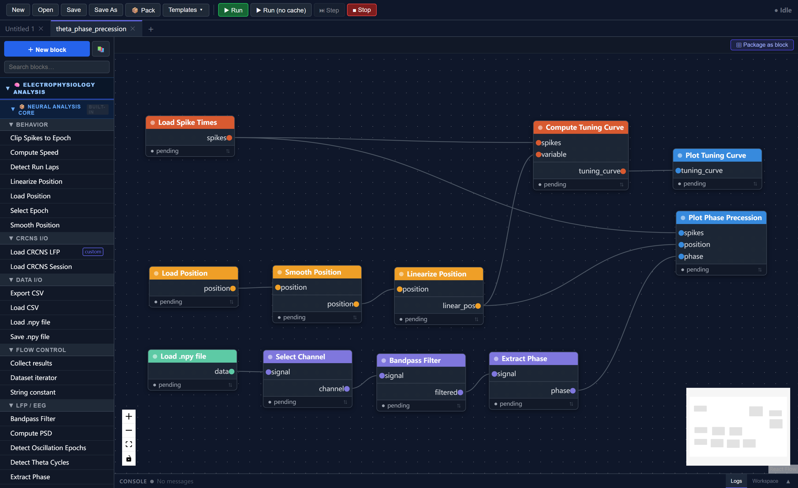

The workflow implements this analysis chain:

```
Load LFP ──► Select channel ──► Bandpass (4–12 Hz) ──► Extract phase
                                                              │
Load spikes ──────────────────────────────────────────► Phase precession plot
                  │                                           │
                  └──► Compute tuning curve ──► Tuning curve plot
                              ▲
Load position ──► Smooth ──► Linearize
```

**What each stage does:**

- **Load LFP / spikes / position** — reads the three `.npy` data files from disk
- **Bandpass filter (4–12 Hz)** — isolates the theta oscillation from the raw LFP
- **Extract phase** — computes instantaneous theta phase via the Hilbert transform
- **Smooth & linearize position** — smooths the raw position trace and projects 2D coordinates onto the 1D track axis
- **Compute tuning curve** — calculates firing rate as a function of position (the place field)
- **Plot tuning curve** — displays the place field
- **Plot phase precession** — scatter plot of spike phase vs. position, showing that spikes systematically shift earlier in the theta cycle as the animal crosses the place field

### 2.2 Set the file paths

Three blocks need file paths pointing to your data. Double-click each one to open its parameter editor:

| Block | Parameter | Value |
|---|---|---|
| **Load LFP** | `file_path` | path to `phase_precession_N_lfp.npy` |
| **Load spike times** | `file_path` | path to `phase_precession_N_spikes.npy` |
| **Load position** | `file_path` | path to `phase_precession_N_position.npy` |

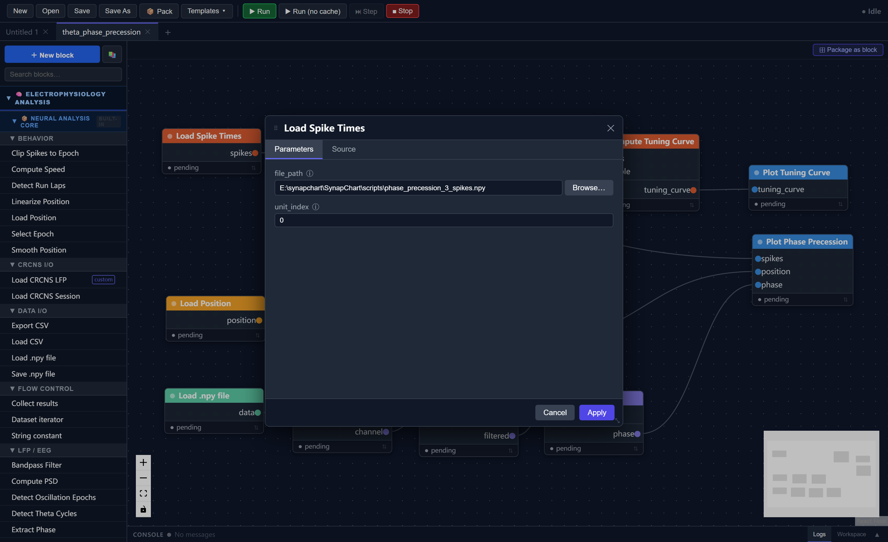

### 2.3 Run the pipeline

Click **Run** in the toolbar. The run progress panel expands at the bottom and shows each block executing in order.

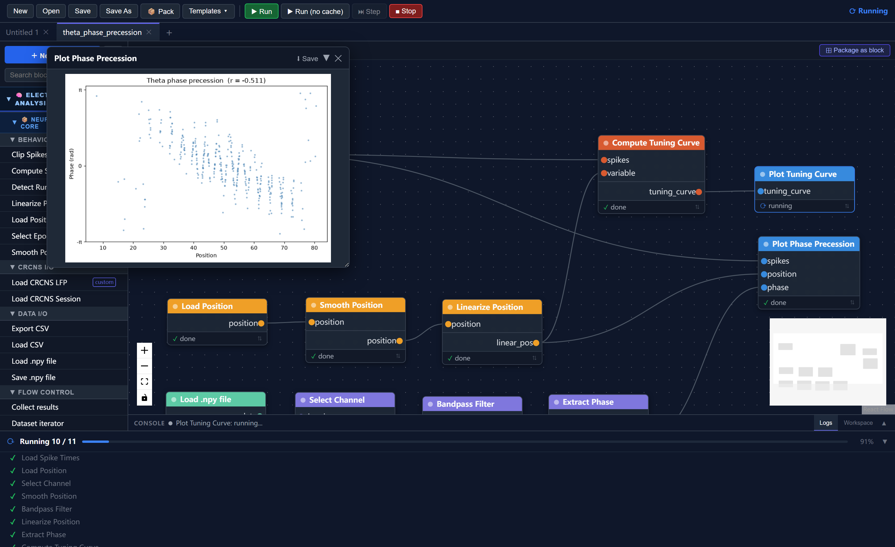

When complete, two visualization windows appear:

- **Place field** — firing rate as a function of position along the track
- **Theta phase precession** — each dot is one spike; the downward slope shows that spikes shift to earlier theta phases as the animal moves through the place field

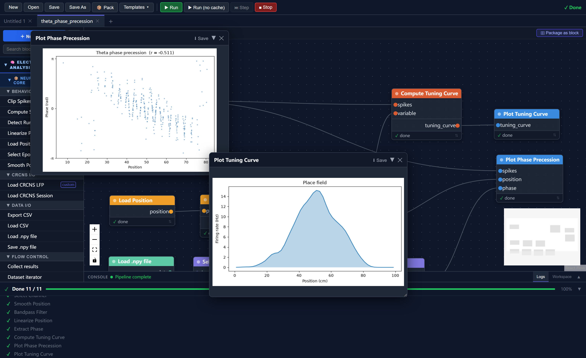

!!! tip
    On subsequent runs, unchanged blocks load from cache automatically — only modified branches re-execute. Change a parameter and only the downstream blocks re-run.

---

## Part 3 — Creating a Custom Block

The template visualises phase precession qualitatively. Here you will create a block that **quantifies** it: computing the Pearson correlation coefficient between spike phase and position. A more negative value indicates stronger phase precession.

### 3.1 Open the block wizard

Click **+ New Block** at the top of the side panel.

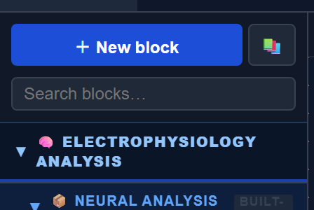

### 3.2 Step 1 — Metadata

| Field | Value |
|---|---|
| Block name | `Get Phase Precession R` |
| block_type_id | `get_phase_precession_r` (auto-filled) |
| Category | `Visualization` |
| Description | `Computes Pearson correlation between spike phase and position as a measure of phase precession strength.` |

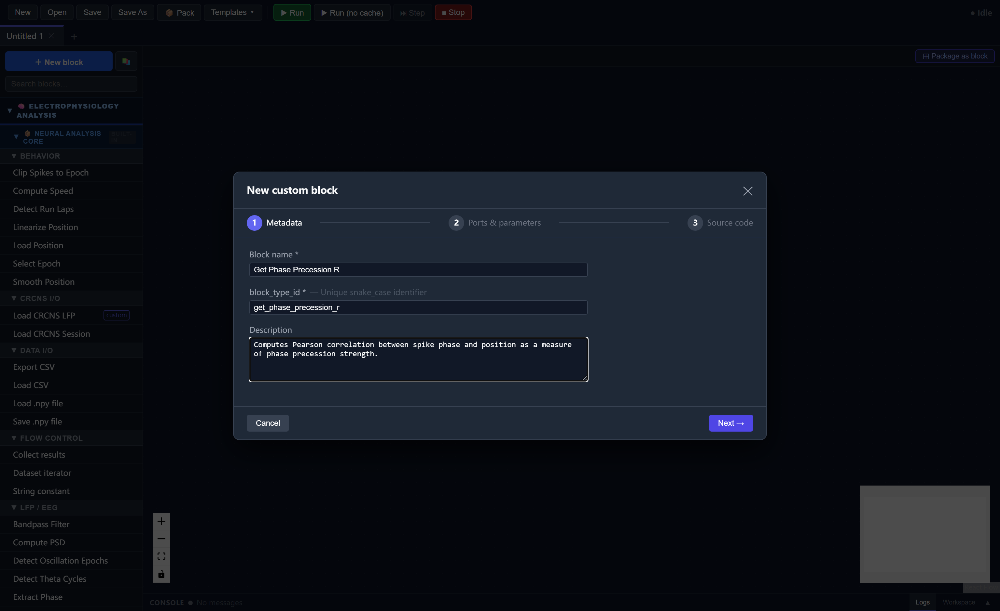

Click **Next**.

### 3.3 Step 2 — Ports & Parameters

**Inputs** — add three rows:

| Port name | Data type | Description |
|---|---|---|
| `spikes` | `NeuroData[spike_times]` | Spike timestamps |
| `phase` | `NeuroData[raw_signal]` | Instantaneous LFP phase |
| `position` | `NeuroData[position]` | Linearized position |

**Outputs** — add one row:

| Port name | Data type | Description |
|---|---|---|
| `corr_r` | `float` | Pearson r (phase vs. position) |

**Parameters** — leave empty.

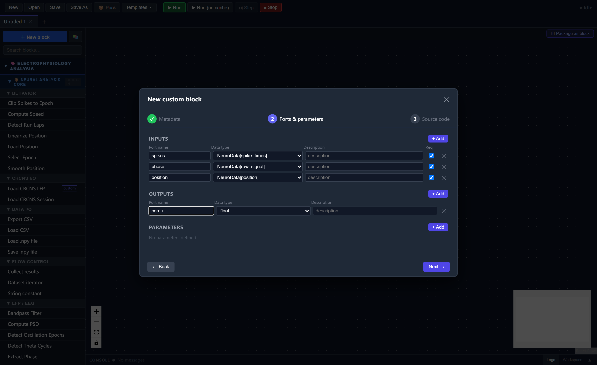

Click **Next**.

### 3.4 Step 3 — Source Code

Replace the template body with:

```python
spikes = inputs["spikes"]
phase_nd = inputs["phase"]
position = inputs["position"]

spike_times = spikes.array

# Get phase and position arrays
phase_arr = phase_nd.array if phase_nd.array.ndim == 1 else phase_nd.array[:, 0]
pos_arr = position.array if position.array.ndim == 1 else position.array[:, 0]

# Build time axes
sr_phase = phase_nd.sampling_rate or 1000.0
sr_pos = position.sampling_rate or 30.0
phase_times = phase_nd.timestamps if phase_nd.timestamps is not None \
    else np.arange(len(phase_arr)) / sr_phase
pos_times = position.timestamps if position.timestamps is not None \
    else np.arange(len(pos_arr)) / sr_pos

# Interpolate phase and position at each spike time
spike_phases = np.interp(spike_times, phase_times, phase_arr,
                         left=np.nan, right=np.nan)
spike_pos    = np.interp(spike_times, pos_times,   pos_arr,
                         left=np.nan, right=np.nan)

# Drop spikes outside the recorded range
valid = ~(np.isnan(spike_phases) | np.isnan(spike_pos))
spike_phases = spike_phases[valid]
spike_pos    = spike_pos[valid]

# Pearson correlation — negative r means phase decreases as position increases
corr_r = float(np.corrcoef(spike_phases, spike_pos)[0, 1])
disp(f"Phase precession r = {corr_r:.4f}")

return {"corr_r": corr_r}
```

!!! note "Built-in helpers"
    `numpy` is always available as `np`. `disp()` prints to the run progress console.

Click **Test Run** to verify the block works, then **Save Block**.

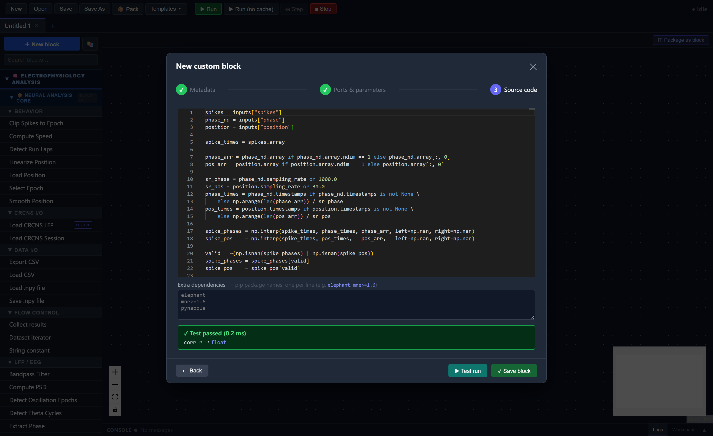

### 3.5 Connect the new block

Drag **Get Phase Precession R** from the side panel onto the canvas. Connect its inputs:

| From block | Port | → | To port |
|---|---|---|---|
| `extract_phase` | `phase` | → | `phase` |
| `load_spike_times` | `spikes` | → | `spikes` |
| `linearize_position` | `linear_pos` | → | `position` |

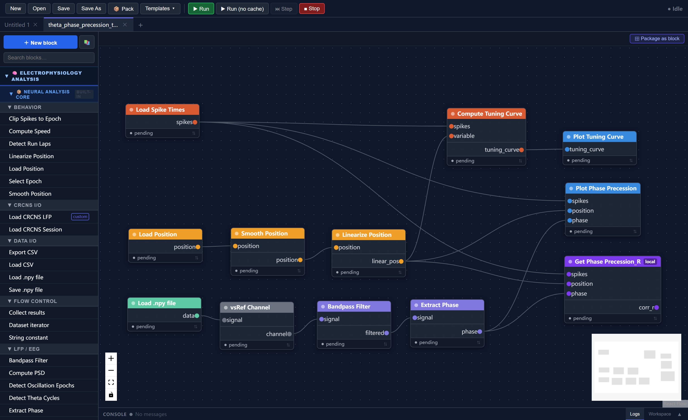

### 3.6 Save and run

Save as `theta_phase_precession_test1.json`. Click **Run**. The progress panel prints:

```
Phase precession r = -0.3821
```

A more negative value indicates stronger phase precession.

---

## Part 4 — Composite Blocks and Multi-Session Analysis

You now have a complete working workflow. Here you will package it as a **composite block** — a single reusable node that encapsulates the entire pipeline — and use it to process two sessions in parallel.

### 4.1 Package the workflow as a composite block

With `theta_phase_precession_test1.json` open, click **⊞ Package as block** in the canvas tab bar.

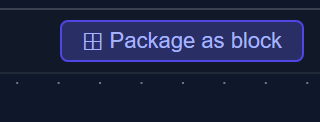

**Step 1 — Promote file path inputs**

Check all three file path parameters to expose them as input ports:

| Promote | Node | Parameter | External port label |
|---|---|---|---|
| ☑ | Load LFP | `file_path` | `lfp_path` |
| ☑ | Load spike times | `file_path` | `spike_path` |
| ☑ | Load position | `file_path` | `pos_path` |

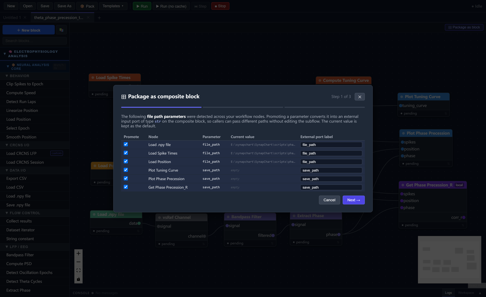

**Step 2 — Select output ports**

Check `corr_r` to expose it as an output:

| Include | Node | Port | External label |
|---|---|---|---|
| ☑ | get_phase_precession_r | `corr_r` | `corr_r` |

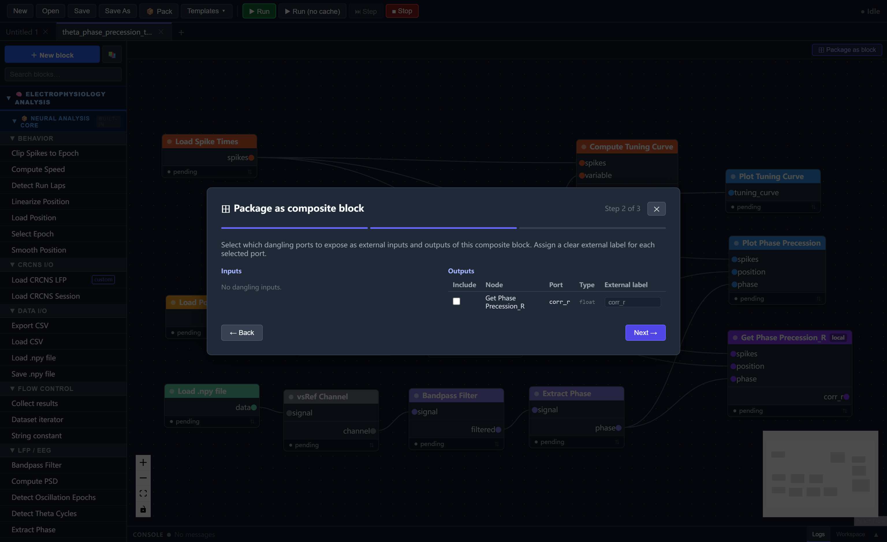

**Step 3 — Metadata**

| Field | Value |
|---|---|
| Block name | `PhasePrecession` |
| block_type_id | `phaseprecession` |
| Category | `Composite` |
| Description | `Full theta phase precession pipeline. Accepts three file paths and outputs the phase-position correlation coefficient.` |

Click **Save composite block**. The block appears in the side panel under **Composite**.

### 4.2 Build the multi-session workflow

Click **New** in the toolbar to start a fresh canvas.

**Add two PhasePrecession composite blocks** — drag **PhasePrecession** from the side panel twice.

**Add six String constant blocks** — find **String constant** under **Flow control** and add six. Set their `value` parameters:

*Session 1:*

| Value |
|---|
| `C:\path\to\scripts\phase_precession_1_lfp.npy` |
| `C:\path\to\scripts\phase_precession_1_spikes.npy` |
| `C:\path\to\scripts\phase_precession_1_position.npy` |

*Session 2:*

| Value |
|---|
| `C:\path\to\scripts\phase_precession_2_lfp.npy` |
| `C:\path\to\scripts\phase_precession_2_spikes.npy` |
| `C:\path\to\scripts\phase_precession_2_position.npy` |

Replace `C:\path\to\scripts\` with the actual path to the repository's `scripts/` folder on your machine.

**Connect the string constants** to the matching ports on each composite block (`lfp_path`, `spike_path`, `pos_path`).

**Add an `average_values` local block** — click **+ New Block** and create:

- **Name:** `average_values`
- **Inputs:** `r1` (float), `r2` (float)
- **Output:** `rave` (float)
- **Source code:**

```python
r1 = float(inputs["r1"])
r2 = float(inputs["r2"])
rave = float((r1 + r2) / 2)
disp(f"averaged_corr_r = {rave:.4f}")
return {"rave": rave}
```

Connect both composite blocks' `corr_r` outputs to `r1` and `r2`.

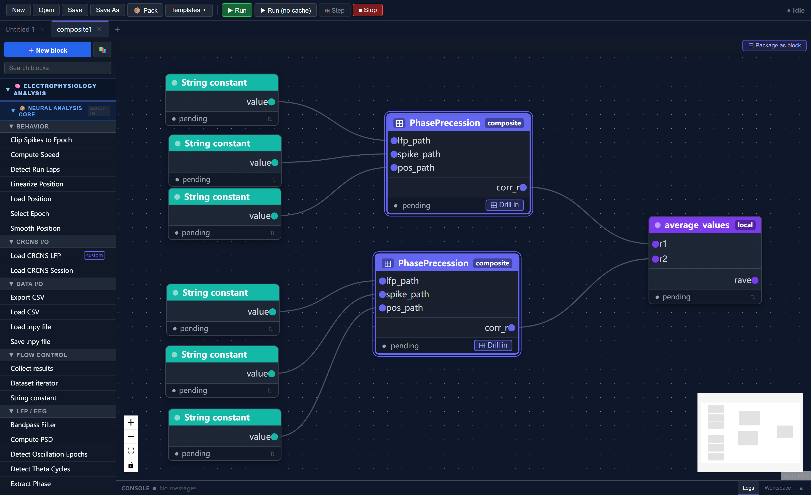

### 4.3 Save and run

Save as `composite1.json`. Click **Run**.

Both `PhasePrecession` blocks execute their full internal pipelines. The progress panel prints:

```
[PhasePrecession / session 1] Phase precession r = -0.3821
[PhasePrecession / session 2] Phase precession r = -0.4103
averaged_corr_r = -0.3962
```

!!! tip "Drilling into a composite block"
    Click the **⊞ Drill in** button at the bottom of any composite node to inspect its internal workflow in a nested canvas tab. Double-click any internal block to edit its parameters without leaving the view.

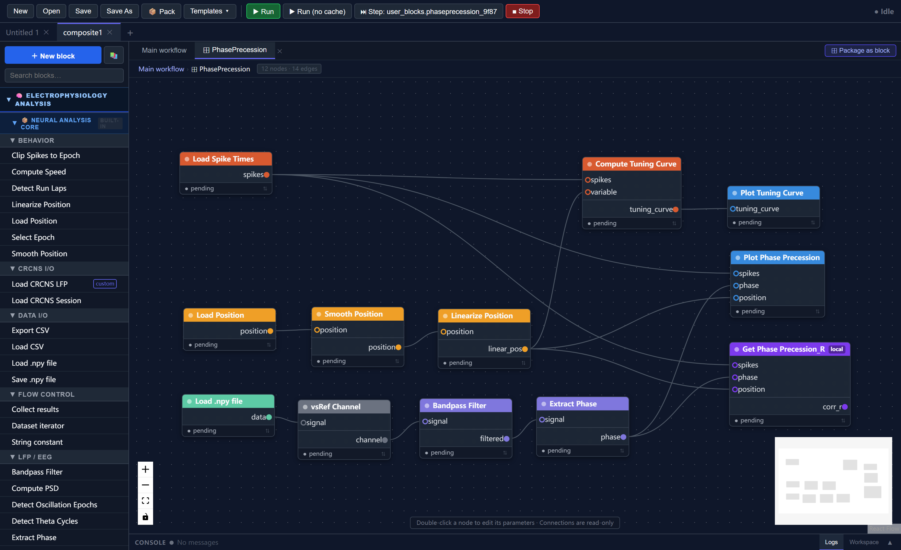

---

## Summary

In this tutorial you:

1. Ran a template theta phase precession workflow on synthetic hippocampal data
2. Created a custom `get_phase_precession_r` block quantifying precession strength as a Pearson correlation
3. Packaged the workflow as a `PhasePrecession` composite block with promoted file path inputs and a `corr_r` output
4. Built a two-session parallel analysis that averages the correlation across sessions

---

## Next Steps

- **[Tutorial 2](tutorial2.md):** Using the dataset iterator to batch-process all three sessions automatically with a CSV file
- **[Tutorial 3](tutorial3.md):** Theta sequences with real hippocampal data — loading a CRCNS HC-11 session and analyzing direction-specific neural dynamics
- [Block Reference](../blocks/index.md) — full documentation of all built-in blocks and their parameters
