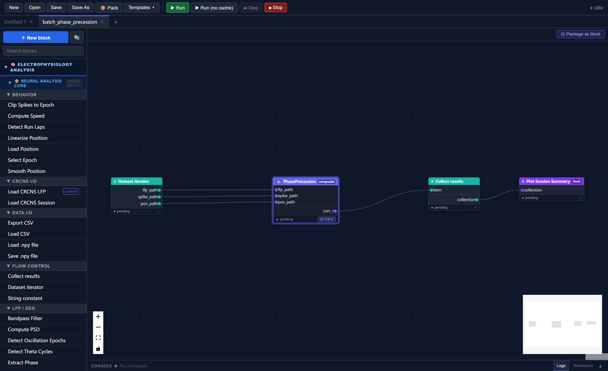
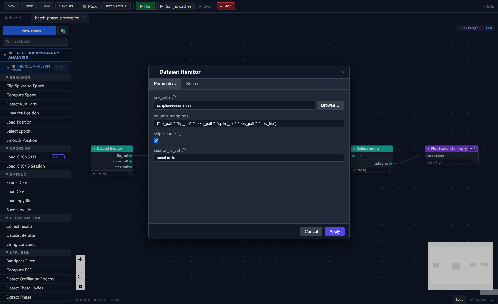
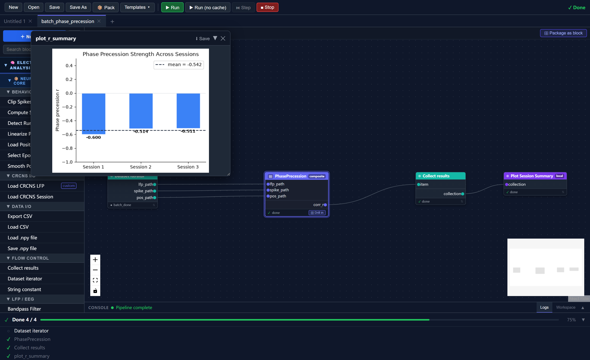

# Tutorial 2: Batch Processing with the Dataset Iterator

In Tutorial 1 you built a `PhasePrecession` composite block that accepts three file paths and returns a correlation coefficient. Processing a second session meant duplicating the composite block manually — connecting six more string constants to two more ports. That approach does not scale to ten or thirty sessions.

This tutorial introduces the **Dataset Iterator**, a flow-control block that reads a CSV file row by row and drives one full downstream execution per row. Combined with the **Collect Results** block, it replaces all that manual wiring with a single table.

By the end you will have:

- Loaded and run the built-in `batch_phase_precession` template
- Understood how the iterator–composite–collect pattern works
- Known how to adapt the pattern to your own CSV and analysis blocks

**Estimated time:** 15–20 minutes  
**Prerequisites:** Tutorial 1 (you should be familiar with composite blocks and how to run a workflow)  
**Data:** The same three synthetic sessions from Tutorial 1 (`scripts/`)

---

## Part 1 — The CSV File

The dataset iterator takes its session list from a plain CSV file. For this tutorial the file `scripts/sessions.csv` is already provided:

```csv
session_id,lfp_file,spike_file,pos_file
session_1,scripts/phase_precession_1_lfp.npy,scripts/phase_precession_1_spikes.npy,scripts/phase_precession_1_position.npy
session_2,scripts/phase_precession_2_lfp.npy,scripts/phase_precession_2_spikes.npy,scripts/phase_precession_2_position.npy
session_3,scripts/phase_precession_3_lfp.npy,scripts/phase_precession_3_spikes.npy,scripts/phase_precession_3_position.npy
```

Each row is one session. Each column that you want to feed into the pipeline becomes an output port of the iterator block at runtime.

!!! note "Paths in the CSV"
    Paths can be absolute or relative to the SynapChart working directory. The example uses relative paths from the project root.

---

## Part 2 — Load the Template

In the toolbar click **Templates**, expand the **Tutorial** category, and select **batch_phase_precession**.

The canvas loads a four-block workflow:

```
Dataset Iterator ──► PhasePrecession ──► Collect Results ──► Plot Session Summary
```



### Block roles

| Block | Role |
|---|---|
| **Dataset Iterator** | Reads `sessions.csv`; on each iteration emits one row's values as string output ports |
| **PhasePrecession** | The composite block from Tutorial 1; runs the full LFP → phase → correlation pipeline once per session |
| **Collect Results** | Accumulates the `corr_r` scalar from each iteration into a single array |
| **Plot Session Summary** | Runs once after all iterations; plots a bar chart of the collected r values |

---

## Part 3 — Inspect the Iterator Block

Double-click **Dataset Iterator** to open its parameter editor.

| Parameter | Value | Meaning |
|---|---|---|
| `csv_path` | `scripts/sessions.csv` | The CSV file to iterate over |
| `column_mappings` | `{"lfp_path": "lfp_file", "spike_path": "spike_file", "pos_path": "pos_file"}` | Maps output port names (left) to CSV column names (right) |
| `skip_header` | `true` | Treat the first row as a header, not data |
| `session_id_col` | `session_id` | Column to use as a session label in the progress log |

The `column_mappings` parameter controls which CSV columns become output ports and what those ports are called. Because it matches the `PhasePrecession` composite's input ports exactly (`lfp_path`, `spike_path`, `pos_path`), the three wires connecting the iterator to the composite carry file paths directly — no string-constant blocks needed.



---

## Part 4 — How Execution Works

When you click **Run**, the executor detects the iterator block and switches from a single pass to a loop:

**Iteration 1 (session_1)**

1. Iterator reads row 1 and injects:
   - `lfp_path` = `scripts/phase_precession_1_lfp.npy`
   - `spike_path` = `scripts/phase_precession_1_spikes.npy`
   - `pos_path` = `scripts/phase_precession_1_position.npy`
2. `PhasePrecession` runs its full internal pipeline and outputs `corr_r = -0.613`
3. `Collect Results` appends `-0.613` to its internal accumulator

**Iteration 2 (session_2)** → appends `corr_r = -0.334`

**Iteration 3 (session_3)** → appends `corr_r = -0.196`

**After the loop**

`Collect Results` stacks the three scalars into a single `NeuroData[any]` array `[-0.613, -0.334, -0.196]` and passes it to **Plot Session Summary**, which runs once and produces a bar chart.

!!! tip "Collect Results is a barrier"
    Nothing downstream of `Collect Results` executes during the loop. It only emits its output after all iterations are complete. This is how a single `Plot Session Summary` block receives all three results at once.

---

## Part 5 — Run the Workflow

Click **Run**. The progress panel shows each session executing in sequence:

```
[session_1] Phase precession r = -0.6130
[session_2] Phase precession r = -0.3340
[session_3] Phase precession r = -0.1960
Mean r = -0.3810  (n=3 sessions)
```

A bar chart appears showing the three r values with the mean overlaid as a dashed line. Blue bars indicate negative correlation (phase precession present); red bars indicate positive (no precession).



---

## Part 6 — Adapting to Your Own Data

To apply this pattern to a different dataset:

**1. Edit the CSV**

Replace the three data rows with your own sessions. You can add as many rows as needed — the iterator handles any number of iterations without any changes to the workflow.

**2. Adjust column mappings (if your columns have different names)**

Open the iterator parameter editor and update `column_mappings` to match your CSV column names. For example:

```json
{"lfp_path": "lfp", "spike_path": "spikes", "pos_path": "position"}
```

The port names on the left (the keys) must match the composite block's input port names. The column names on the right (the values) must match your CSV header.

**3. Swap the composite block**

If you have a different analysis block — say, a `ThetaSequence` composite — replace `PhasePrecession` with it and update `column_mappings` to match its input ports. The iterator, collect, and plot blocks are generic and reusable across any analysis.

!!! note "Multiple outputs per iteration"
    A composite block can expose multiple output ports. Use one `Collect Results` block per output you want to gather. Each collects its upstream port independently.

---

## Part 7 — The Collect Results `axis` Parameter

By default `Collect Results` stacks scalars into a 1D array of shape `(R,)` where R is the number of sessions. For higher-dimensional outputs the `axis` parameter controls where the new sessions dimension is inserted.

For example, if your composite outputs an `N × M × T` tensor and you set `axis = 3`, the final collected array has shape `N × M × T × R`. Valid axis values range from 0 to the number of dimensions in the output tensor (inclusive).

!!! warning "All iterations must produce the same shape"
    `Collect Results` raises an error if two iterations return arrays of different shapes. If your sessions have different lengths, pad or crop the output to a fixed size in the composite block before it reaches `Collect Results`.

---

## Summary

In this tutorial you:

1. Loaded the `batch_phase_precession` template
2. Understood how the Dataset Iterator reads a CSV and drives one full pipeline execution per row
3. Understood how Collect Results acts as a barrier, accumulating per-iteration outputs into a single array for downstream blocks
4. Learned how to adapt the iterator–composite–collect pattern to your own data and analysis blocks

---

## Next Steps

- **[Tutorial 3](tutorial3.md):** Theta sequences with real hippocampal data — loading a CRCNS HC-11 session and analyzing direction-specific neural dynamics
- [Flow Control Blocks](../advanced/flow-control.md) — full reference for Dataset Iterator and Collect Results parameters
- [Composite Blocks](../advanced/composite-blocks.md) — how to build and package your own composite blocks
