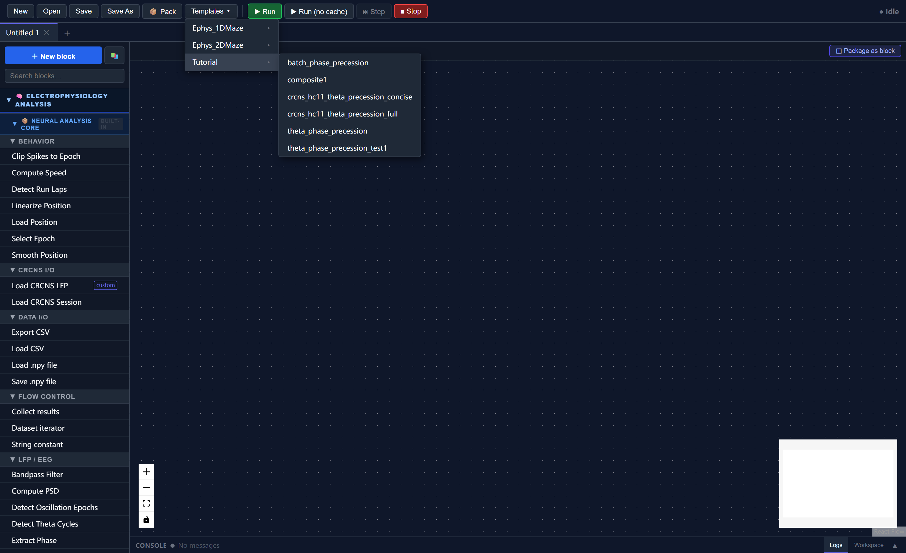
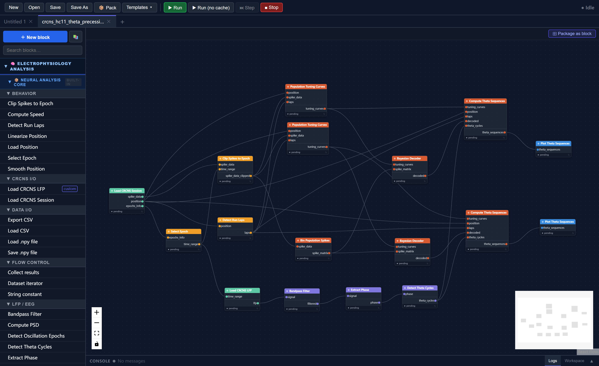
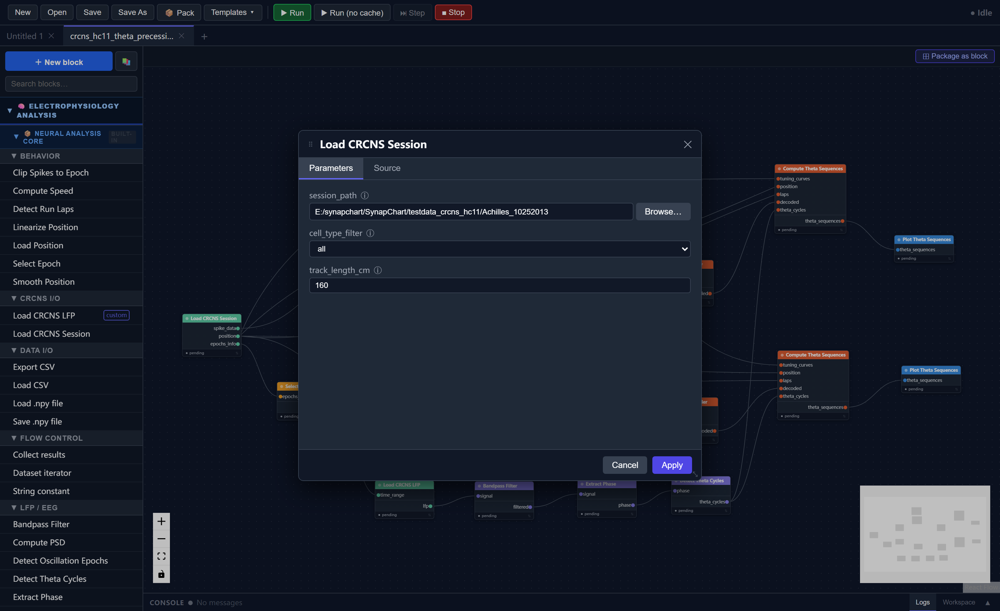
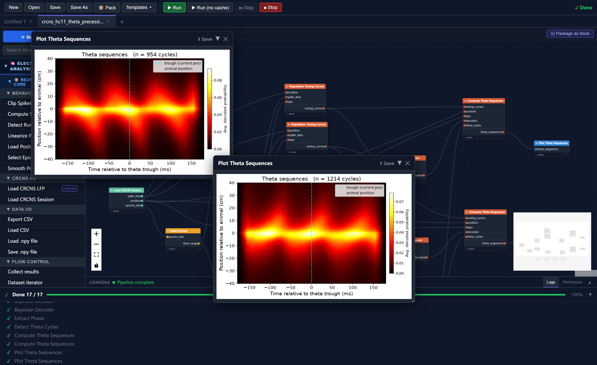

# Tutorial 3: Theta Sequences with Real Hippocampal Data

This tutorial runs a complete theta sequence analysis on a real hippocampal recording from the publicly available CRCNS HC-11 dataset. Unlike the synthetic data in Tutorials 1–2, this pipeline works directly from the original `.mat` and `.eeg` files with no preprocessing required.

By the end you will have:

- Loaded a real CRCNS HC-11 recording session into SynapChart
- Understood how **running direction** is used as a behavioral state key to drive parallel analysis branches
- Computed direction-specific population tuning curves, Bayesian-decoded posteriors, and averaged theta sequences
- Produced a theta sequence heatmap for each running direction

**Estimated time:** 20–30 minutes  
**Prerequisites:** None — this tutorial is self-contained  
**Data:** One session from the CRCNS HC-11 dataset (free account required at crcns.org)

!!! note "What are theta sequences?"
    During active navigation, hippocampal place cells fire in sequences within individual theta cycles (~8 Hz): cells representing locations *ahead* of the animal fire early in the cycle, cells at the current location fire near the trough, and cells representing locations *behind* fire late. Averaging decoded posteriors across many theta cycles and aligning them to the animal's current position reveals a characteristic diagonal stripe — the **theta sequence** — showing the hippocampus sweeping through a spatial trajectory on every cycle.

---

## Part 1 — The CRCNS HC-11 Dataset

CRCNS HC-11 contains simultaneous multi-electrode recordings from hippocampal area CA1 and the medial entorhinal cortex in rats running on a linear track. Each session includes multi-unit spike times, 1-D linearised position, and wideband LFP.

**To download:**

1. Create a free account at [crcns.org](https://crcns.org)
2. Navigate to **HC → HC-11** and download one session. This tutorial uses **Achilles_10252013**
3. Extract the archive. You should have a folder like:

```
Achilles_10252013/
    Achilles_10252013_sessInfo.mat   ← session metadata, spikes, position, epochs
    Achilles_10252013.eeg            ← wideband LFP (all channels, ~11 GB)
    Achilles_10252013.xml            ← probe geometry and sampling rate metadata
```

!!! tip "Disk space"
    The `.eeg` file can be 5–15 GB. The pipeline loads only the MazeEpoch portion (typically < 30 minutes) so peak RAM usage stays manageable, but make sure you have enough free disk space to extract the archive.

---

## Part 2 — Load the Template

In the toolbar click **Templates**, expand the **Tutorial** category, and select **crcns_hc11_theta_precession_concise**.



The canvas loads a 17-node pipeline arranged in two parallel analysis branches that share a common data-loading trunk:

```
Load CRCNS Session ──► Select Epoch ──► Clip Spikes to Epoch ──────────────────────┐
         │                                                                           │
         └──► position ──────────────────────────────────────────────────────────┐  │
         │                                                                        │  │
         └──► Detect Run Laps ────────────────────────────────────────────────┐  │  │
                                                                               │  │  │
Load CRCNS LFP ──► Bandpass (6–12 Hz) ──► Extract Phase ──► Detect Theta Cycles  │  │
                                                                               │  │  │
Clip Spikes ──► Bin Population Spikes ──────────────────────────────────────┐  │  │  │
                                                                             │  │  │  │
                              ┌─ Dir 1 branch ─────────────────────────────┘  │  │  │
                              │  Tuning Curves (dir=1) ◄────────────────────────┘  │
                              │       │                                            │
                              │  Bayesian Decoder ◄── spike_matrix                │
                              │       │                                            │
                              │  Theta Sequences (dir=1) ◄── theta_cycles, laps ──┘
                              │       │
                              │  Plot Theta Sequences
                              │
                              └─ Dir 2 branch (identical, direction=2)
                                 ...
                                 Plot Theta Sequences
```



---

## Part 3 — Set the Session Path

Only two parameters need to be changed. Double-click each block and update its `session_path`:

| Block | Parameter | Value |
|---|---|---|
| **Load CRCNS Session** | `session_path` | `/path/to/Achilles_10252013` |
| **Load CRCNS LFP** | `session_path` | `/path/to/Achilles_10252013` |

Both blocks point to the same folder. Everything else is pre-configured for the HC-11 dataset.



!!! note "Other parameters you can tune"
    - **Load CRCNS Session → `cell_type_filter`**: `all` (default), `pyramidal`, or `interneuron`
    - **Load CRCNS Session → `track_length_cm`**: set to the known track length (default 160 cm for HC-11)
    - **Load CRCNS LFP → `channels`**: which LFP channel to use (default `0`)

---

## Part 4 — The Shared Trunk

The first group of blocks loads and prepares the data. These run once and feed both direction branches.

### 4.1 Load CRCNS Session

Reads the `*_sessInfo.mat` file and returns:

| Output | Contents |
|---|---|
| `spike_data` | Multi-cell spike times with per-spike cell IDs |
| `position` | Linearised 1-D position (cm) at ~39 Hz, covering the full recording |
| `epochs_info` | Epoch boundaries: MazeEpoch, PREEpoch, POSTEpoch, sleep epochs |

### 4.2 Select Epoch → Clip Spikes to Epoch

**Select Epoch** extracts the `MazeEpoch` time window (`[t_start, t_end]`) from the epoch boundaries. This window is passed to two blocks:

- **Load CRCNS LFP** — uses it to load only the maze-epoch LFP slice, avoiding reading the full ~11 GB file into memory
- **Clip Spikes to Epoch** — restricts the spike data to the same window

### 4.3 Detect Run Laps

Scans the position trace and identifies continuous high-velocity running bouts (**laps**) that exceed the speed (`5 cm/s`), duration (`1 s`), and distance (`30 cm`) thresholds.

Each detected lap is labelled with a **direction**:

- **Direction 1** — descending runs (animal moves from high position to low position)
- **Direction 2** — ascending runs (animal moves from low to high)

The laps object stores all detected bouts and is passed to both direction branches.

### 4.4 LFP Processing: Bandpass → Phase → Theta Cycles

| Block | What it does |
|---|---|
| **Bandpass Filter** (6–12 Hz) | Isolates the theta oscillation from the raw LFP |
| **Extract Phase** | Computes instantaneous phase via the Hilbert transform (0 = peak, ±π = trough) |
| **Detect Theta Cycles** | Finds individual peak-to-peak cycles (expected 4–12 Hz, so 83–250 ms duration) |

The cycle boundaries array (`N_cycles × 2`) is shared by both direction branches.

### 4.5 Bin Population Spikes

Converts the clipped multi-cell spike times into a `(n_cells × n_time_bins)` spike count matrix using 20 ms bins — the input format required by the Bayesian decoder.

---

## Part 5 — Running Direction as a Behavioral State

This is the key design pattern in the template.

On a linear track, hippocampal cells are **direction-selective**: a cell's firing rate at a given position often differs substantially between inbound and outbound runs. Computing a single tuning curve that pools both directions would mix these two firing patterns and degrade decoding accuracy.

The template handles this by treating **running direction as a behavioral state key**: instead of one analysis branch, there are two identical branches that differ only in which laps they use.

### How it works

The `direction` parameter appears in three blocks per branch:

| Block | `direction` parameter | Effect |
|---|---|---|
| **Population Tuning Curves** | `1` or `2` | Occupancy and spike counts are computed only during laps of this direction |
| **Compute Theta Sequences** | `1` or `2` | Only theta cycles whose midpoint falls inside a lap of this direction are accumulated |
| **Bayesian Decoder** | *(none)* | Uses whichever tuning curves it receives — the direction is implicitly set by the tuning curve input |

Setting `direction="1"` in a branch and `direction="2"` in the other is sufficient to route each branch to the correct behavioral epochs. The blocks handle the filtering internally — no manual data splitting is required.

### What you get

Each branch produces an independent theta sequence heatmap reflecting the neural dynamics during *that* running direction:

- **Direction 1 heatmap**: averaged decoded posteriors across descending laps, aligned to the animal's position at each theta trough
- **Direction 2 heatmap**: same for ascending laps

Comparing the two heatmaps lets you assess whether theta sequences are symmetric across directions — a question with implications for the directionality of hippocampal trajectory coding.

### Choosing what to visualize or compare

The template visualizes both directions independently. You can adapt this in several ways:

- **Use only one direction**: delete one branch and set `direction="both"` in the other if you want all laps pooled
- **Average the two heatmaps**: add a custom block that receives both `theta_sequences` outputs and averages the matrices
- **Add more behavioral states**: if you have multiple epochs (e.g., separate sleep and wake periods) you can duplicate branches for each, connecting a different epoch's `laps` or `time_range` to each copy

This pattern generalises to any categorical behavioral variable — running speed bands, reward zones, correct vs. error trials — wherever separate tuning curves and averaged dynamics are scientifically meaningful.

---

## Part 6 — Run and Interpret

Click **Run**. The run progress panel expands and shows blocks executing in order. Typical runtime for a full MazeEpoch session on a modern laptop:

| Stage | Approx. time |
|---|---|
| Load session + LFP | 5–20 s (depends on disk speed) |
| Bandpass + phase + cycles | < 5 s |
| Tuning curves (× 2) | 5–15 s |
| Bayesian decoding (× 2) | 10–30 s |
| Theta sequences (× 2) | 10–30 s |

!!! tip "Caching accelerates re-runs"
    After the first run, every block caches its output. Changing only a plotting parameter re-runs only the plot block — all upstream computation is loaded from cache instantly.

When complete, two visualization windows appear — one per direction.

### Reading the theta sequence heatmap



| Axis | What it shows |
|---|---|
| **x-axis** | Time relative to the theta trough (ms); 0 = trough = animal's current position |
| **y-axis** | Position relative to the animal (cm); positive = ahead, negative = behind |
| **Colour** | Average decoded probability across all cycles of this direction |

A strong theta sequence appears as a **diagonal stripe running from bottom-left to top-right**: early in the cycle (negative time) the decoded location is behind the animal, and late in the cycle (positive time) it is ahead. This look-ahead effect reflects the hippocampus sweeping through a prospective spatial trajectory on each theta cycle.

The cyan dashed vertical line marks the trough (t = 0). The white dotted horizontal line marks the animal's actual position (relative position = 0). A diagonal of high probability crossing both reference lines is the hallmark of a theta sequence.

!!! note "Interpreting weaker sequences"
    Theta sequences are typically clearest in the first MazeEpoch and in animals with strong, well-isolated place cells. If the heatmap looks flat or noisy, try the `Achilles` or `Buddy` animals which tend to have the largest cell counts in HC-11.

---

## Part 7 — Adjustable Parameters

Once you have run the pipeline once, you can experiment with the following parameters without re-running the expensive upstream stages (the cache handles it):

**Theta sequence accumulation**

| Parameter | Default | Effect |
|---|---|---|
| `half_window_ms` | 180 | Width of the time window around each trough. Increase to see more context; decrease to focus on a single cycle |
| `n_time_per_cycle` | 36 | Temporal resolution within the window (~10 ms per bin at default) |
| `n_pos_lags` | 41 | Width of the look-ahead/behind axis in position bins |
| `min_speed` | 5 cm/s | Minimum running speed to include a cycle; increase to restrict to fast runs |

**Visualization**

| Parameter | Default | Effect |
|---|---|---|
| `ylim_cm` | 40 | Half-range of the y-axis; increase for long-range sequences |
| `colormap` | `hot` | Matplotlib colormap name |
| `theta_freq_hz` | 8 | Used to draw the optional ±½-cycle reference lines |
| `save_path` | *(empty)* | Set to a `.png` path to save the figure to disk |

---

## Summary

In this tutorial you:

1. Downloaded a session from the public CRCNS HC-11 dataset and loaded it with two blocks — no preprocessing required
2. Understood the shared analysis trunk: epoch selection, spike clipping, LFP theta processing, and spike binning
3. Learned how **running direction acts as a behavioral state key** — the pipeline automatically restricts occupancy, spike counts, and theta cycle accumulation to laps of the correct direction, giving you direction-specific tuning curves, decoded posteriors, and theta sequence heatmaps
4. Ran the pipeline and interpreted the resulting heatmaps, where a diagonal stripe from lower-left to upper-right indicates the hippocampus sweeping through a prospective spatial trajectory on each theta cycle
5. Saw how to extend the pattern to other behavioral states by duplicating branches and changing the `direction` (or epoch) parameter

---

## Next Steps

- [Block Reference](../blocks/index.md) — full documentation of all built-in blocks and their parameters
- [Flow Control Blocks](../advanced/flow-control.md) — Dataset Iterator and Collect Results for batch processing across multiple sessions
- [Composite Blocks](../advanced/composite-blocks.md) — package this pipeline as a reusable block (Tutorial 1 covers the basics)
